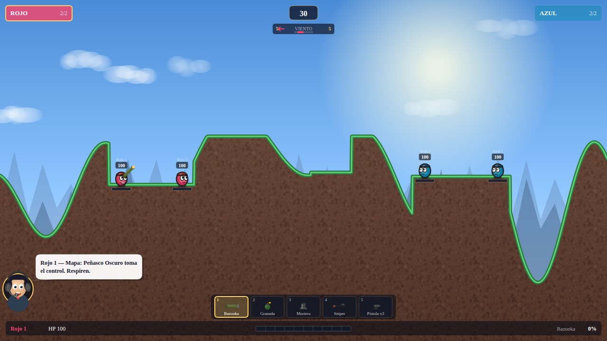

# Eggplosion

A multiplayer tactical artillery game, built with Phaser 3, Node.js, and WebSockets.



## 🚀 Features

- **Multiplayer**: Real-time multiplayer support via WebSockets.
- **AI Opponent**: Built-in AI for single-player practice.
- **Destructible Terrain**: Fully dynamic terrain that reacts to explosions.
- **Varied Arsenal**: Multiple weapons including Bazooka, Grenade, Mortar, Sniper, and Pistol x3.
- **Dynamic Wind**: Environment conditions that affect projectile trajectories.
- **Commentary System**: An AI commentator that reacts to the action in real-time.

## 🛠 Tech Stack

- **Frontend**: Phaser 3, Vanilla JavaScript
- **Backend**: Node.js, `ws` (WebSockets)
- **Styling**: Vanilla CSS
- **Deployment**: Firebase Hosting

## 🎮 Controls

| Action              | Control                                   |
| :------------------ | :---------------------------------------- |
| **Move Left/Right** | `←` / `→`                                 |
| **Aim Up/Down**     | `↑` / `↓`                                 |
| **Jump**            | `Space` (Tap)                             |
| **Fire**            | `Space` (Hold to charge, release to fire) |
| **Switch Weapon**   | `1-5` (Number keys) or `Q`/`E`            |

## 🛠 Setup & Local Development

### Prerequisites

- Node.js (v16 or higher recommended)
- npm (comes with Node.js)

### Installation

1.  Clone the repository:

    ```bash
    git clone <repository-url>
    cd Eggplosion
    ```

2.  Install dependencies:
    ```bash
    npm install
    ```

### Running Locally

1.  Start the WebSocket server:

    ```bash
    npm run server
    ```

2.  Open `index.html` in your browser. You can use a local server like `Live Server` in VS Code or any static file server.
    - To enable Multiplayer mode, add `?mp=1` to the URL (e.g., `http://localhost:5500/index.html?mp=1`).

## 🧪 Testing & Verification

### Unit Tests

Run the unit tests using Jest:

```bash
npm test
```

### Frontend Verification

To verify that the game loads correctly and generate a screenshot, you can use the provided Python script (requires Playwright):

```bash
python3 verification/verify_game_load.py
```

This will generate `verification/game_loaded.png`.

## 🚀 Deployment

The project is configured for Firebase Hosting.

To deploy:

```bash
npm run deploy
```

## 📄 License

This project is for educational/personal use.
